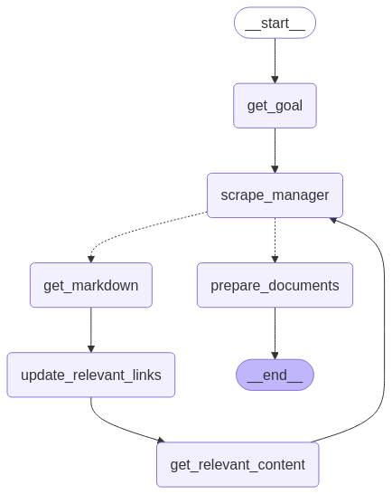

# chimacs

### Description:
Rufus is a Agentic AI workflow developed with LangGraph that implements a web crawler that takes user instructions, identifies a goal, and then systematically scrapes relevant content from a website. It uses a combination of LLMs, web scraping, and vector similarity to extract and filter pertinent information.

### Steps to run
```
git clone https://github.com/achalaspandit/chimacs.git

```
create .env file and add the following API keys
```
GROQ_API_KEY="your_groq_api_key"
LANGSMITH_TRACING=true
LANGSMITH_ENDPOINT="https://api.smith.langchain.com"
LANGSMITH_API_KEY="your_langsmith_api_key"
LANGSMITH_PROJECT="your_langsmith_name"
JINA_API_KEY = "your_jina_api_key"
OPENAI_API_KEY = "your_openai_key"
```


### Workflow Details



Node-by-Node Explanation:

* \_start_ (Start Node):The workflow begins here, initializing the state and preparing for user input.

* get_goal:This node analyzes the user's instructions to determine the primary objective. It uses a large language model to understand the intent and extracts any initial URLs provided by the user.
Example from given input: from the input of """instructions = "We're making a chatbot for the HR in Riverside." documents = client.scrape("https://riversideca.gov/")""", the goal that the LLM should extract is "making a chatbot for the HR in Riverside." and the link "https://riversideca.gov/" will be added to the list of links to be scraped.

* scrape_manager:
This node manages the scraping process. It selects the next URL to be visited from the list of discovered links, ensuring that each link is visited only once and that the scraping does not continue indefinitely.

* get_markdown:
This node retrieves the content from the selected URL. It fetches both the page's Markdown content and its sitemap to ensure comprehensive data collection.

* update_relevant_links:
This node analyzes the content of the scraped page to find new links. It uses an LLM to determine which of these links are most relevant to the user's goal, ensuring that the crawler focuses on pertinent information.

* get_relevant_content:
This node extracts the most relevant content from the scraped page. It uses vector embeddings and cosine similarity to find text chunks that are semantically related to the user's goal, ensuring that only the most pertinent information is retained.

* prepare_documents:
This node prepares the extracted content for final use. It can be extended to perform tasks such as formatting, summarizing, or further filtering of the data.
* \_end_ (End Node):
The workflow concludes here, with all relevant content extracted and prepared.